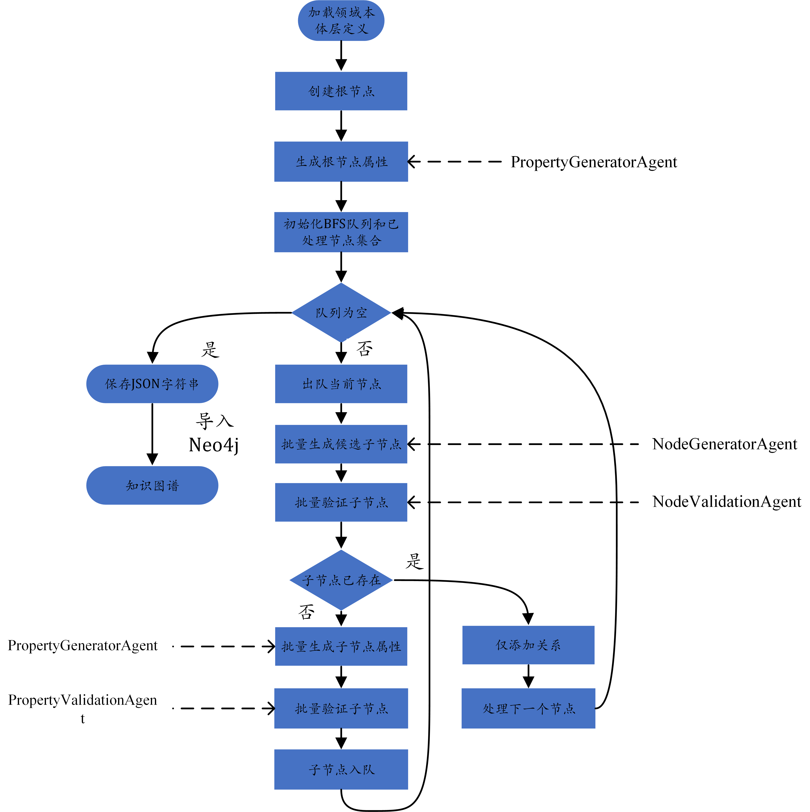

# 基于领域本体和大语言模型的知识图谱自动化构建工具

## 原理图：



## 项目结构：

<pre><code>
├── 📁 README.assets/             # 图片
├── config.py                     # 配置文件，读取环境变量与模型参数
├── format_kg_for_lightrag.py     # 将生成的JSON字符串格式化为LightRAG的需要的JSON字符串格式
├── KG_generate.py                # 核心图谱构建流程，采用广度优先搜索的方式
├── knowledge_graph.json          # 构建完成的知识图谱示例
├── lightrag_formatted_kg.json    # 供 LightRAG 使用的格式化图谱文件
├── LightRAG_insert_kg.py         # 插入知识图谱至 LightRAG和利用LightRAG对知识图谱进行问答
├── neo4j_import.py               # 插入知识图谱至 Neo4j 的脚本
├── ontology.json                 # 本体层示例
├── README.md                     # 项目说明文档
</code></pre>
## 使用流程：

1. 配置config.py文件（配置LLM API， Neo4j用户名，密码，Embedding PATH，ROOT_TYPE等）
2. 启动neo4j（可视化）
3. 运行KG_generate.py(得到知识图谱)

4. 运行format_kg_for_lightrag.py（得到格式化的JSON字符串）
5. 运行LightRAG_insert_kg.py(对知识图谱进行问答)

## 示例：

```json
{
  "entity_types": [
    {
      "type": "computer_science",
      "description": "计算机科学"
    },
    {
      "type": "sub_domain",
      "description": "计算机科学的子领域"
    }
  ],
  "relationships": [
    {
      "src_type": "computer_science",
      "tgt_type": "sub_domain",
      "relation": "has_subdomain",
      "description": "计算机科学包含不同的子领域"
    }
  ],
  "properties": {
    "computer_science": ["description"],
    "sub_domain": ["description"]
  }
}


```

