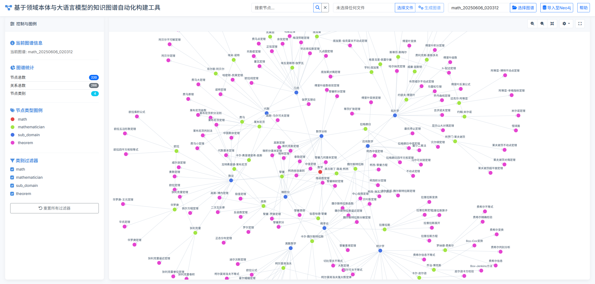

# 基于领域本体和大语言模型的知识图谱自动化构建工具

## 工具运行效果：



## 项目结构：

<pre><code>
├── 📁 KG                         # 生成的知识图谱示例
├── 📁 ontology                   # 本体层示例
├── 📁 README.assets/             # 图片
├── app.py                        # 后端服务
├── config.py                     # 配置文件
├── KG_generate.py                # 核心图谱构建文件
├── neo4j_import.py               # 插入知识图谱至 Neo4j 的脚本
├── knowledge_graph.html          # 前端页面
├── README.md                     # 项目说明文档
</code></pre>

## 使用流程：

1. 在.env文件中配置NEO4J_URI（Neo4j运行地址）、 NEO4J_USERNAME（Neo4j用户名）、 NEO4J_PASSWORD（Neo4j密码）、DEEPSEEK_API_KEY(DEEPSEEK API KEY)、GENSTUDIO_API_KEY(无问芯穹API KEY)、 LLM_TYPE（选择的LLM类型）、 MAX_CONCURRENCY(并发量)、LLM_TIMEOUT_SECONDS（LLM API调用的超时时间）、LLM_RETRY_ATTEMPTS（响应出错时的重试次数）、EMBEDDING_MODEL（Embedding路径）
2. 启动neo4j（便于将生成的节点导入至neo4j）
3. ```python app.py```启动后端
4. http://127.0.0.1:5000/ 打开前端

## 本体层设计示例：
```json
{
  "entity_types": [
    {
      "type": "computer_science",
      "description": "计算机科学"
    },
    {
      "type": "sub_domain",
      "description": "计算机科学的子领域"
    }
  ],
  "relationships": [
    {
      "src_type": "computer_science",
      "tgt_type": "sub_domain",
      "relation": "has_subdomain",
      "description": "计算机科学包含不同的子领域"
    }
  ],
  "properties": {
    "computer_science": ["description"],
    "sub_domain": ["description"]
  }
}


```

